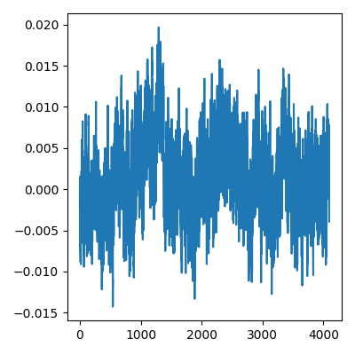
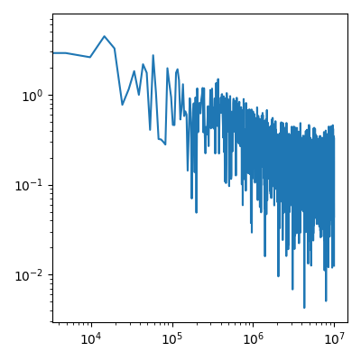
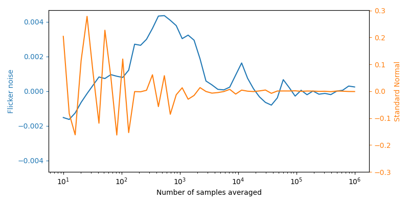

# python-drawings

## Euler's formula

source code: [eulers_formula.py](./eulers_formula.py)

## Flicker noise

source code: [flickernoise.py](./flickernoise.py)

|Time series of Flicker noise                                   |Spectrum of flicker noise                                  |Law of Large Numbers does not hold for flicker noise         |
|---------------------------------------------------------------|-----------------------------------------------------------|-------------------------------------------------------------|
|||